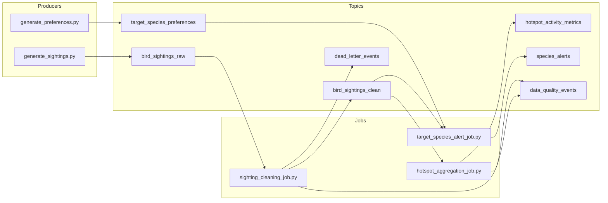

# Birding Buddy — Streaming Core

[](https://github.com/korsakowii/birding-buddy-streaming-core/actions/workflows/ci.yml)

**Bird sighting events → Kafka (Redpanda) → three stream jobs → metrics and alerts.**  
This repo is a **small, runnable** data-engineering demo: synthetic field checklists exercise **event-time**, **state**, **windows**, **data quality**, and **joins**—without a generic “clickstream” story.

## What this is / what it is not

| Dimension | Description |
|-----------|-------------|
| **Is** | A **local**, **single-node** [Redpanda](https://redpanda.com/) (Kafka-compatible) streaming semantics demo: Python producers/consumers, synthetic birding topics, and `pytest` for pure helpers. |
| **Is not** | Production **Apache Kafka** or **Apache Flink** operations—no cluster HA, no managed connectors, no exactly-once guarantee story beyond design notes. |
| **Data** | **Synthetic only** (`user_*`, `loc_*`, generated species codes). No live checklist APIs, no real field observations, no credentials. |

**Why a log / broker:** sightings are **async** (mobile/offline), **replayed** after code changes, and **fan out** to unrelated consumers (hotspot dashboards vs per-user alerts). Kafka-compatible storage decouples ingest from processing and makes **at-least-once + replay** explicit.

**Concepts illustrated:** topic layering (raw / clean / DQ / DLQ), **partition keys**, **event-time** tumbling windows, **watermark-style** lateness handling, **stateful dedup**, **dimension-style** preferences, and **replay-aware** design (see table below).

## Resume-safe summary (factual)

- Built a **Kafka-compatible** (Redpanda) **event pipeline** with **topic layering** (raw → validated clean stream → metrics / alerts / DQ / DLQ).  
- Implemented **validation**, **stateful `event_id` deduplication**, **15-minute event-time windows** with simplified **watermark/lateness** handling, and a **preference–sighting join** with alert suppression (Python MVP, maps to Flink patterns in docs).  
- Added **unit tests** for validation, dedup, and window/lateness logic **without Docker**; optional Docker Compose loop for end-to-end synthetic produce/consume.  
- **Scope:** teaching and prototype boundaries are documented explicitly—**not** a production streaming platform.

## What this proves (single-node MVP)

This repository is a **local-first synthetic demo**: three Python consumer/producer loops against Redpanda, not a clustered Flink deployment. It proves **readable separation** of raw ingest, validated facts, operational telemetry, DLQ routing, windowed aggregates, and preference-driven alerts—with **`pytest`** covering pure validation/window/dedup helpers.

- Example payloads: **`docs/sample_outputs.md`**  
- Engineering rationale and boundaries: **`docs/streaming_concepts.md`**

---

## Architecture



**Stack:** Python consumers/producers + **Redpanda** (`localhost:19092`). Job logic is written to map cleanly to **Flink DataStream** ideas (`docs/flink_concepts_mapping.md`); **PyFlink** is intentionally not required for the local loop.

---

## What this demonstrates

| Component | Kafka / Flink angle |
|-----------|---------------------|
| `bird_sightings_raw` | append-only ingest; retries → duplicate keys in the log |
| `sighting_cleaning_job.py` | validation; **keyed dedup** on `event_id` (Flink: keyed state); routing bad rows |
| `dead_letter_events` | DLQ topic; poison / invalid payloads isolated from analytics |
| `data_quality_events` | **side-output** style signals (duplicates, validation, late drops) |
| `bird_sightings_clean` | curated fact stream for downstream jobs |
| `hotspot_aggregation_job.py` | **event-time** 15m tumbling windows; `WM ≈ max(event_time) − lateness` |
| `hotspot_activity_metrics` | windowed aggregation keyed by `(location_id, species_code)` |
| `target_species_preferences` | preference **changelog** (compact in production) |
| `target_species_alert_job.py` | **broadcast / dim join** analog; alert suppression state |
| `species_alerts` | user-facing derived stream (keyed by `user_id`) |
| Makefile + `pytest` | repeatable demo + unit tests for pure logic |

---

## Why birding data fits streaming

- **Late uploads:** `event_time` reflects the hike; the record may arrive hours later—classic **event-time vs processing-time** tension.
- **Duplicate sightings:** flaky clients and retries reuse `event_id`; pipelines must be **idempotent** or **dedupe**.
- **Location hotspots:** rare birds concentrate observers; **`location_id`-keyed** traffic mirrors real **partition skew** problems.
- **Personal “target species” alerts:** user-specific rules are a **slowly changing dimension** layered onto a fast fact stream—natural **join / broadcast state** story.

---

## Prerequisites

- Docker + Docker Compose  
- Python 3.10+

## Local setup

```bash
cd birding-buddy-streaming-core
make setup
source .venv/bin/activate
```

Manual: `python3 -m venv .venv && source .venv/bin/activate && pip install -r requirements.txt`

## Makefile quick reference

| Command | Purpose |
|---------|---------|
| `make setup` | Create `.venv` and install deps |
| `make start` / `make stop` | Docker Compose (Redpanda) |
| `make test` | `pytest` |
| `make produce-sightings` / `make produce-preferences` | Synthetic load |
| `make clean-job` / `make hotspot-job` / `make alert-job` | Stream processors |
| `make list-topics` | Topics via `rpk` in container |
| `make consume-clean` … `make consume-dlq` | `rpk topic consume` (interactive; Ctrl+C) |

**Scripts:** `./scripts/run_demo.sh` (broker + short preference seed + sighting producer + next-step banner), `./scripts/inspect_topics.sh` (copy-paste `rpk` for raw/clean/metrics/alerts/DQ/DLQ).

## 5-minute demo path

1. `make setup && source .venv/bin/activate`
2. `make start` → `make list-topics` (wait until `bird_sightings_raw` exists)
3. `make test`
4. Three shells with `export KAFKA_BOOTSTRAP_SERVERS=localhost:19092`: `make clean-job`, `make hotspot-job`, `make alert-job`
5. Load: `./scripts/run_demo.sh` **or** `make produce-preferences` (background) + `make produce-sightings`
6. Observe: `make consume-clean`, `make consume-dq`, `make consume-dlq`, `make consume-hotspots`, `make consume-alerts` (or `./scripts/inspect_topics.sh`)

**Narration hooks**

- **Duplicates:** same `event_id` on raw; duplicates surface as `duplicate_event_id` on `data_quality_events`, not in `bird_sightings_clean`.
- **Late events:** backdated `event_time`; hotspot path may emit `late_event_dropped` when watermark + **allowed lateness** have moved on (`HOTSPOT_ALLOWED_LATENESS_SEC`, default `120`).
- **Invalid rows:** bad required fields / timestamps → `dead_letter_events` (+ validation entries on `data_quality_events`).

Step-by-step detail: `docs/demo_walkthrough.md`.

## Broker

```bash
make start
docker compose ps
make list-topics
```

Kafka API on the host: **`localhost:19092`**. Inside the container **`rpk` uses `127.0.0.1:9092`**.  
`make list-topics` only works when the `birding-redpanda` container is running (`make start`).

## Producers & processors

```bash
export KAFKA_BOOTSTRAP_SERVERS=localhost:19092
make produce-sightings
make produce-preferences
```

```bash
make clean-job
make hotspot-job
make alert-job
```

`generate_sightings.py` flags: `--rate`, `--dup-rate`, `--late-rate`, `--invalid-rate`, `--bootstrap`.

## Inspect topics

```bash
make consume-clean
docker exec -it birding-redpanda rpk topic consume bird_sightings_clean -X brokers=127.0.0.1:9092 -n 20 -f '%v\n'
docker exec -it birding-redpanda rpk topic consume hotspot_activity_metrics -X brokers=127.0.0.1:9092 -n 20 -f '%v\n'
docker exec -it birding-redpanda rpk topic consume species_alerts -X brokers=127.0.0.1:9092 -n 20 -f '%v\n'
docker exec -it birding-redpanda rpk topic consume data_quality_events -X brokers=127.0.0.1:9092 -n 20 -f '%v\n'
docker exec -it birding-redpanda rpk topic consume dead_letter_events -X brokers=127.0.0.1:9092 -n 20 -f '%v\n'
```

## Engineering tradeoffs (expanded)

| Idea | One-liner |
|------|-----------|
| Topic design | Separate raw, clean, quality telemetry, DLQ, and human-facing outputs. |
| Partition keys | `location_id` for sightings (hotspot locality); `user_id` for alerts. |
| Event-time vs processing-time | Windows use `event_time`; operators still use wall clocks for watermarks in this MVP. |
| Watermark / lateness | Simplified `max(event_time) − allowed_lateness` policy in code comments + DQ signals. |
| Stateful dedup | In-memory set in demo; production: keyed state + TTL + idempotent sinks. |
| Replay | Kafka offsets + at-least-once; dedup keys reduce double impact on replay. |
| Backpressure | Lag grows if sinks slow; bounded poll intervals and flow control matter operationally. |

Design discussion notes: `docs/operational_tradeoffs.md`.

## Production extensions

This repo stops at a **single-node MVP**. For state TTL, checkpoints, transactional sinks, lag/SLO monitoring, hot-key mitigation, real **radius** geojoins, and external providers (e.g. eBird-style feeds), see **`docs/production_hardening.md`**.

## Tests

```bash
make test
```

## Documentation

- `docs/sample_outputs.md` — synthetic example payloads per topic  
- `docs/streaming_concepts.md` — design notes and explicit MVP boundary  
- `docs/demo_walkthrough.md` — command-by-command walkthrough  
- `docs/production_hardening.md` — production evolution  
- `docs/architecture.md` — system narrative + diagrams  
- `docs/kafka_topics.md` — per-topic contracts  
- `docs/flink_concepts_mapping.md` — Flink mapping  
- `docs/failure_scenarios.md` — failure modes  
- `docs/operational_tradeoffs.md` — operational tradeoffs + FAQ-style prompts  

## License

[MIT](LICENSE)
