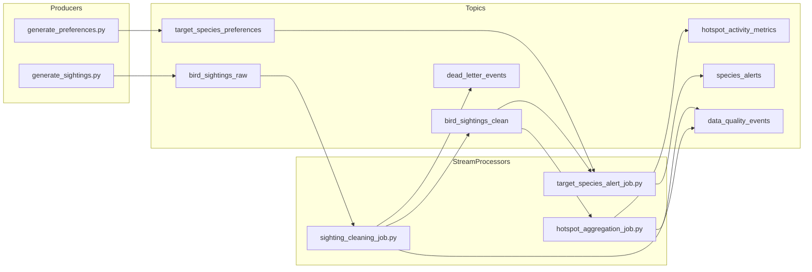

# Birding Buddy — Streaming Core (Interview MVP)

Minimal, **runnable** Kafka-style streaming demo for **Birding Buddy**, a real-time birding intelligence system. The domain is intentionally specific (ebird-like sightings, rarity targets, busy hotspots) so you can explain **event-time**, **state**, **windows**, and **data quality** without leaning on a generic clickstream story.

## Why this is not a generic clickstream demo

- **Field reality**: bird sightings arrive **late** (sync after a hike), are **duplicated** by flaky mobile retries, and need **species-level** validation—not “product ID” inventory.
- **Human context**: users keep **target species lists** (rarity / personal chase list) that act like a **dynamic dimension table**—a crisp analogy to Flink broadcast state or changelog feeds.
- **Spatial hotspots**: aggregating activity by **`location_id` + species** mirrors geospatial “busy place” analytics and makes **partition skew** a natural interview topic.

## Architecture



**Implementation note:** this repo uses **Python + Redpanda** (Kafka protocol) for a fast local loop. Job code is written so each step maps cleanly to **Flink DataStream** concepts (see `docs/flink_concepts_mapping.md`). PyFlink was intentionally not required so `docker compose up` stays lightweight.

## Prerequisites

- Docker + Docker Compose
- Python 3.10+

## Local setup

**Fast path (recommended):**

```bash
cd birding-buddy-streaming-core
make setup
source .venv/bin/activate
```

**Manual equivalent:**

```bash
python3 -m venv .venv
source .venv/bin/activate
pip install -r requirements.txt
```

## Makefile quick reference

| Command | Purpose |
|---------|---------|
| `make setup` | Create `.venv` and install Python deps |
| `make start` / `make stop` | Start / stop Docker Compose (Redpanda) |
| `make test` | Run `pytest` |
| `make produce-sightings` | Sighting producer (~5 evt/s) |
| `make produce-preferences` | Preference producer |
| `make clean-job` / `make hotspot-job` / `make alert-job` | Stream processors |
| `make list-topics` | `rpk topic list` inside the container |
| `make consume-clean` / `consume-hotspots` / `consume-alerts` / `consume-dq` / `consume-dlq` | `rpk topic consume` (interactive; Ctrl+C to exit) |

**Helpers:** `bash scripts/run_demo.sh` (broker + seed preferences + sighting producer + printed next steps), `bash scripts/inspect_topics.sh` (copy-paste `rpk` commands, including `bird_sightings_raw`).

## 5-minute demo path

Use this sequence when you want a **repeatable** interview dry run.

1. **Bootstrap:** `make setup && source .venv/bin/activate`
2. **Broker:** `make start` then `make list-topics` (topics should exist after `redpanda-init` finishes).
3. **Confidence check:** `make test`
4. **Processors:** open **three** terminals, `export KAFKA_BOOTSTRAP_SERVERS=localhost:19092`, run `make clean-job`, `make hotspot-job`, `make alert-job`.
5. **Load:** either `bash scripts/run_demo.sh` **or** `make produce-preferences` (background) + `make produce-sightings`.
6. **Observe:** `make consume-clean`, `make consume-dq`, `make consume-dlq`, `make consume-hotspots`, `make consume-alerts` (or paste commands from `scripts/inspect_topics.sh`).

**What to point at while speaking:**

- **Duplicates:** same `event_id` appears on `bird_sightings_raw` more than once; second+ emit `duplicate_event_id` on `data_quality_events` and do **not** land in `bird_sightings_clean`.
- **Late events:** producer often sets `event_time` hours in the past; hotspot job may emit `late_event_dropped` on `data_quality_events` when the simplified watermark has advanced beyond **allowed lateness**.
- **Invalid records:** empty `user_id` / `species_code`, negative `count`, or bogus `event_time` → `dead_letter_events` (+ validation signals on `data_quality_events`).

Full step-by-step + interview phrasing: `docs/demo_walkthrough.md`.

## Start the broker (Redpanda)

From the repo root:

```bash
make start
# or: docker compose up -d
```

This starts **Redpanda** on **`localhost:19092`** (Kafka API) and an **init** job that creates all topics.

Verify:

```bash
docker compose ps
make list-topics
```

(Host machines use port **19092**; inside the container the broker listens on **9092**.)

## Run producers

With **venv** activated and `KAFKA_BOOTSTRAP_SERVERS=localhost:19092`:

```bash
make produce-sightings
make produce-preferences
```

Or run the scripts directly:

```bash
python producer/generate_sightings.py --rate 5
python producer/generate_preferences.py --rate 0.5
```

Flags:

- `generate_sightings.py`: `--rate`, `--dup-rate`, `--late-rate`, `--invalid-rate`, `--bootstrap`

## Run stream processors

Each job is a standalone process (like a Flink task manager running one pipeline):

```bash
make clean-job
make hotspot-job
make alert-job
```

Equivalent:

```bash
python -m stream_processor.sighting_cleaning_job
python -m stream_processor.hotspot_aggregation_job
python -m stream_processor.target_species_alert_job
```

Optional tuning:

- `HOTSPOT_ALLOWED_LATENESS_SEC` (default `120`) — controls how **lateness** is simulated relative to the **watermark** in the hotspot job.

## Inspect output topics

Using `rpk` from inside the container:

```bash
make consume-clean
docker exec -it birding-redpanda rpk topic consume bird_sightings_clean -X brokers=127.0.0.1:9092 -n 20 -f '%v\n'
docker exec -it birding-redpanda rpk topic consume hotspot_activity_metrics -X brokers=127.0.0.1:9092 -n 20 -f '%v\n'
docker exec -it birding-redpanda rpk topic consume species_alerts -X brokers=127.0.0.1:9092 -n 20 -f '%v\n'
docker exec -it birding-redpanda rpk topic consume data_quality_events -X brokers=127.0.0.1:9092 -n 20 -f '%v\n'
docker exec -it birding-redpanda rpk topic consume dead_letter_events -X brokers=127.0.0.1:9092 -n 20 -f '%v\n'
```

`bash scripts/inspect_topics.sh` prints the same `docker exec … rpk topic consume …` lines for **raw**, **clean**, **hotspots**, **alerts**, **DQ**, and **DLQ**.

## Core streaming concepts demonstrated

| Topic | What you can say in an interview |
|-------|-----------------------------------|
| **Kafka topic design** | Raw vs clean vs quality vs dead-letter separation; alerts as a derived topic |
| **Partition key design** | `location_id` for sightings to co-locate hotspot traffic; `user_id` for alerts |
| **Event-time processing** | `event_time` drives windows; processing time is only for operator milestones |
| **Watermarking** | Simplified `WM = max(event_time) - allowed_lateness` in `hotspot_aggregation_job.py` |
| **Late events** | Intentionally backdated `event_time` in the producer; routing / drop policy in code + `data_quality_events` |
| **Stateful deduplication** | In-memory `event_id` set in cleaning job (Flink: keyed state + TTL) |
| **Window aggregation** | 15-minute tumbling windows keyed by `(location_id, species_code)` |
| **Stream join / matching** | Preferences updated continuously; sightings match on `species_code` (radius left as extension) |
| **Dead-letter topic** | Invalid JSON / failed validation goes to `dead_letter_events` with reason codes |
| **Replay-safety** | Kafka offsets + at-least-once replay; dedup / idempotency keys prevent double impact |
| **Checkpoint recovery** | Conceptual: Flink checkpoints pair state snapshots with Kafka offsets; here: restart re-reads from `earliest` (demo) |
| **Backpressure** | If sinks slow, consumer lag grows; Flink uses credit-based flow control; bounded `max.poll.interval` matters in Kafka clients |

## Interview explanation (short)

This repo is intentionally **small**: one broker, three jobs, synthetic producers. The goal is a **clean narrative** you can draw on a whiteboard: **ingest → validate/dedupe → event-time windows → joins against preferences → human-visible alerts**, with **explicit** bad-data and **late-data** paths.

See `docs/interview_talking_points.md` for a 2-minute pitch plus Q&A prompts.

## Tests

```bash
make test
# or: pytest
```

## Documentation

- `docs/demo_walkthrough.md` — exact commands, expected observations, interview phrasing
- `docs/production_hardening.md` — how this MVP would evolve toward production
- `docs/architecture.md` — end-to-end system view
- `docs/kafka_topics.md` — topic contracts
- `docs/flink_concepts_mapping.md` — how each Python job maps to Flink concepts
- `docs/failure_scenarios.md` — failure modes + mitigation patterns
- `docs/interview_talking_points.md` — pitch + Q&A

## License

MIT (add a `LICENSE` file if you publish publicly).
