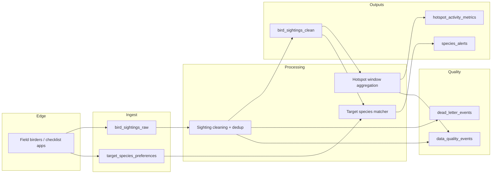

# Architecture

Birding Buddy Streaming Core is a **small, local** pipeline that shows how a real-world “community sightings” product would **ingest**, **clean**, **aggregate**, and **alert** in near real time.

## End-to-end view

## Why Kafka (or Kafka-compatible Redpanda) fits here

- **Durable buffer** when processors restart or temporarily fall behind.
- **Replay** for backfills: reprocess historical sightings when alert rules change.
- **Fan-out**: the same clean sighting stream feeds **hotspot metrics** and **personal alerts** without tight coupling.
- **Key-based scaling**: partition keys echo how you would scale real consumers (location hotspots vs user alerts).

## What is intentionally out of scope (MVP)

- Exactly-once end-to-end guarantees (requires transactional Kafka + idempotent sinks + Flink two-phase commit patterns).
- Geo distance joins for `radius_km` (hook is documented; production would use a spatial index / join library).
- Auth, schema registry enforcement, and fine-grained ACLs.

This keeps the demo **honest**: it shows the *shapes* of production problems without pretending to be a full platform.
